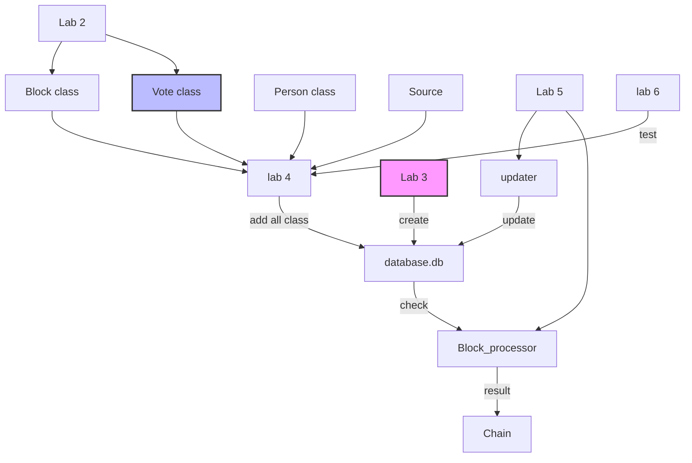

# labs

# Programming Practice: Lab 7 — Documentation

Даний проєкт є результатом виконання лабораторних робіт №2-6. Основна мета — розробка системи **BlockProcessor** з використанням SQL для збереження та обробки даних.

## 1. Структура проєкту

Проєкт організований за модульним принципом, де кожна частина відповідає за свій рівень логіки:

- **lab 2:** Створення класів 'Block', 'Vote'.
- **lab 3:** Створює базу даних `database.db`.
- **lab 4:** Заповнює таблиці в `database.db` за допомогою класів.
- **lab 5(updater):** За допомогою нього можна додавати дані з файлу csv і вручну до 'database.db'.
- **lab 5(Block_processor):** Кожні 2 секунди перевіряє 'database.db' і друкує список блоків в таблиці 'block'
- **Database Layer (Labs 4-5):**  Включає роботу з SQL, створення таблиць, вставку блоків та вибірку даних.
- **Lab 6:** Використання Pydantic для валідації вхідних даних та Pytest для автоматичного тестування всієї системи.

## Архітектура та взаємодія компонентів

Діаграма нижче відображає, як вхідні дані проходять валідацію через Pydantic-моделі та зберігаються в SQL-базу даних:

